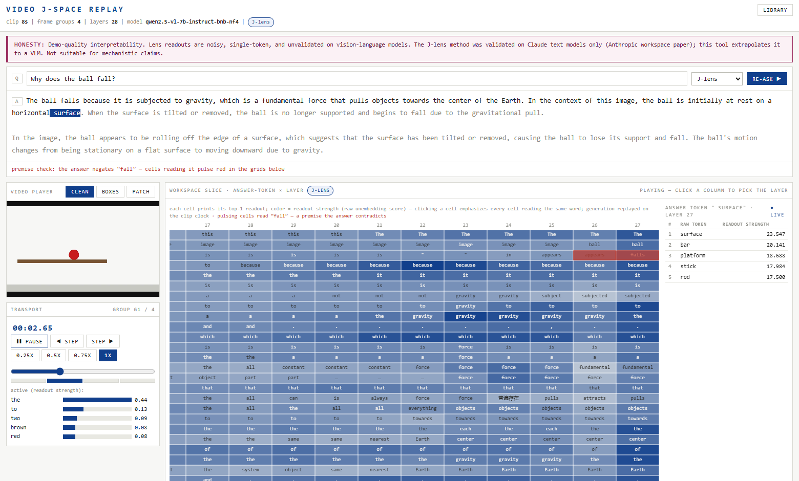

# J-Space-Replay

A J-lens-style visual debugger for video questions on a local
Qwen2.5-VL-7B (4-bit, single NVIDIA GPU).

Inspired by Anthropic's [*Verbalizable Representations Form a Global
Workspace in Language Models*](https://transformer-circuits.pub/2026/workspace/index.html)
and by [WeZZard/jlens-qwen36](https://github.com/WeZZard/jlens-qwen36)
(the same idea for text), but **not a research-grade reproduction** of
the paper.

The goal is practical:

> Can we watch what a local vision-language model reads internally from a
> video, layer by layer, while it forms its answer?

Upload a 5–25 s clip, ask a question, and replay the model's decoded
per-layer readouts synced to the video timeline.



## Demo examples

**Answer precursors.** Ask "Why does the ball fall?" on a synthetic
ball-drop clip (screenshot above). While the answer streams, the
workspace grid reads `gravity` at layers 22–25 several tokens before the
model writes it. The bands are visible: echo at early layers, workspace
words in the middle, the emitted token at layer 27.

**Premise checks.** Ask a question whose premise the clip contradicts
("why is the cat dry?" on a cat-bath clip). Cells whose readouts contain
the contradicted term pulse red — the model registers the premise
internally before its answer corrects it.

**Computed but unsaid.** On the same ball-drop clip, layer ~24 patch
readouts move `level → horizontal, move → off, right` as the ball rolls
and falls. The final answer (a generic gravity explanation) never
mentions any of this.

These are diagnostic signals, not mind-reading. See the honesty section.

## Status

Working demo. Every trace is badged with the lens that decoded it; the
two lenses cache separately and never overwrite each other.

| lens | what it is | status |
|---|---|---|
| `logit-lens-v1` | identity readout, `unembed(norm(h))` | default |
| `j-lens-v1` | analytic Jacobian transport into final-residual space, then the same readout (the paper's J-lens) | opt-in, fit locally |

Measured on this model (issue #8, `reports/jlens_evidence.md`):

- Answer-token readouts get much cleaner at every layer under the J-lens;
  layer 27 stays exactly the logit lens (J = I there, per the paper).
- Visual-patch content onset moves from layer ~25 to ~22, with coherent
  motion words at 22–26.
- Concept recall on the synthetic gate improves ~31%.
- Mid layers (8–20) on visual patches stay content-free even under a
  verified lens. Reported as measured.

**This is not evidence about "the model's thoughts."**
**This is not validated on VLMs — the paper validated text models only.**
**Not suitable for mechanistic claims.**

The UI states it verbatim:

> Demo-quality interpretability. Lens readouts are noisy, single-token, and
> unvalidated on vision-language models. The J-lens method was validated on
> Claude text models only (Anthropic workspace paper); this tool extrapolates
> it to a VLM. Not suitable for mechanistic claims.

**What works well:** the answer-token × layer word grid (top-1 word per
cell, click to drill to raw top-10), premise-check pulses, late-layer
patch readouts, instant replay of cached traces.

**What's demo-quality:** concept labels (high precision, sparse — marked
experimental in the trace; the raw grid is the primary view), patch
overlays, synthetic-clip baselines.

**What's not done:** interventions (steer/swap/ablate), multi-token
concepts, natural-video baselines, the paper's workspace-level
experiments.

## Requirements

| Requirement | Detail |
|---|---|
| GPU | NVIDIA, 16 GB VRAM (reference: RTX 5070 Ti). 12 GB is the tested floor. |
| Driver | R570+ (CUDA 12.8). The cu128 wheels bundle the toolkit. |
| RAM | 32 GB recommended; activations stream to CPU. |
| Disk | ~30 GB (model ~16 GB, env ~10 GB, traces). |
| Python | 3.11/3.12 via [`uv`](https://docs.astral.sh/uv/). Node 20+ for the frontend. |
| OS | Windows 11 is the reference target; Linux is CI-tested. |

No C++ build tools. The stack avoids everything that compiles on Windows
(no flash-attn, no vLLM, no decord). A VRAM pre-flight guard refuses jobs
below 12 GiB free instead of OOM-ing mid-pass.

## Quick start

### Option A: full pipeline (GPU)

```bash
git clone https://github.com/pixiiidust/j-space-replay.git
cd j-space-replay
uv sync
uv run python scripts/download_model.py   # pinned revision, checksums verified
npm --prefix frontend ci && npm --prefix frontend run build
uv run jsr up
```

Open http://127.0.0.1:8000. Upload a clip, ask a question, wait ~1–3 min.

### Option B: instant demo, no GPU

```bash
uv run jsr up --demo
```

Seeds three demo clips with pre-baked traces. The library is browsable
immediately.

### Option C: fit the J-lens (once, ~80 min)

```bash
uv run python scripts/fit_jlens.py
```

The lens ships as a recipe, not weights (~1.4 GB of per-layer matrices,
not committed). Once fitted, pick "J-lens" in the UI when asking; the
upload form defaults to it.

Uploads are validated with friendly errors: ≤ 100 MB, ≤ 25 s, standard
H.264/H.265 MP4 or VP9/AV1 WebM.

## The UI

- **Query console** (top): question in, answer out, token by token.
  Click an answer token to seek the replay. Lens picker next to re-ask.
- **Workspace grid** (hero): answer-token × layer, top-1 word printed in
  each cell, color = readout strength. Click a cell for the raw top-10;
  clicking also highlights every cell reading the same word. Rows reveal
  as the clip plays.
- **Video player**: clean, grounding boxes, or patch-heatmap overlay.
- **Library**: every past trace, badged by lens, re-opens instantly.

## How it works

The J-lens at layer ℓ is a matrix `J_ℓ` that maps a residual-stream
activation into the final-residual basis, so
`softmax(W_U · norm(J_ℓ · h_ℓ))` gives vocabulary scores. `J_ℓ` is the
network's input→output Jacobian, averaged over positions and a corpus of
video prompts. The chain is `J_{ℓ-1} = J_ℓ · M_ℓ` with `J = I` at the
final layer, so the logit lens is the J-lens special case.

Each `M_ℓ` is assembled analytically (closed-form RMSNorm, SwiGLU
Hadamard trick, attention-core cotangents) from the original bf16
checkpoint weights, and every component is verified against autograd —
errors and the method's stated approximations are in
`reports/jlens_evidence.md`.

One pipeline pass per (video, question, lens): sample frames → forward
pass with per-layer hooks (residuals stream to CPU) → lens decode →
label extraction → grounding queries → `trace.json` (schema v1, validated
on write and on read).

## Project layout

```
src/jsr/
  model.py        # locked stack: NF4 + SDPA + fp16, Qwen2.5-VL-7B
  video.py        # PyAV frame sampling + 2-frame groups
  capture.py      # forward hooks, residuals streamed to CPU
  positions.py    # visual-token position map (temporal x spatial grid)
  lens.py         # logit lens + JLens transport (shared decode path)
  jacobian.py     # analytic per-layer Jacobians (verified vs autograd)
  jweights.py     # true-precision weights from the original checkpoint
  labels.py       # concept extraction (z-scored vs lens-specific baseline)
  trace.py        # pipeline: clip + question -> trace.json
  server/         # FastAPI app, job queue, stores, VRAM pre-flight
frontend/         # React + Vite: player, word grid, drill, library
scripts/
  fit_jlens.py            # fit the J-lens over the video corpus
  verify_jacobians.py     # per-component autograd verification gates
  gate0_parity.py         # true-weight vs NF4 runtime parity check
  workspace_range.py      # classify layers echo/workspace/motor from a trace
  make_baseline.py        # per-lens z-score baseline stats
  quality_gate.py         # concept quality gate (precision/recall evidence)
reports/          # measured evidence: M1, M2, gate 0, J-lens verdict
```

## Limitations

- Single-token readouts only; multi-token concepts need the paper's
  extension.
- The J-lens is fit on true checkpoint weights but applied to 4-bit
  runtime activations (measured drift 7–14% per layer branch; carried in
  the lens metadata).
- Position/prompt-averaged Jacobians chained as a product of averages —
  the paper's stated approximation, ~1–4% per-layer junction error here.
- The fit corpus is 15 synthetic clips with one default question.
  Natural-video fits are untested.
- 5–25 s clips at 1 FPS, 480p caps. Not real-time; a 15 s clip traces in
  well under 90 s on the reference GPU.

## Acknowledgements

The analytic J-lens recipe is ported from
[WeZZard/jlens-qwen36](https://github.com/WeZZard/jlens-qwen36)
(Apache-2.0) — see [NOTICE](NOTICE). Method from Anthropic's
[workspace paper](https://transformer-circuits.pub/2026/workspace/index.html).
Model: [Qwen2.5-VL-7B-Instruct](https://huggingface.co/Qwen/Qwen2.5-VL-7B-Instruct)
(Apache-2.0), downloaded at runtime, not redistributed.

## License

Apache-2.0. See [LICENSE](LICENSE).
